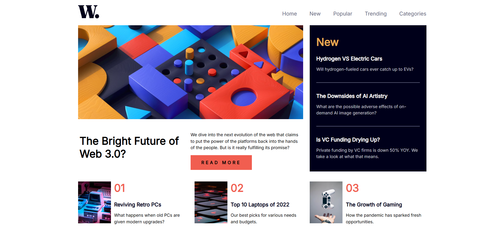

# Frontend Mentor - News homepage solution

This is a solution to the [News homepage challenge on Frontend Mentor](https://www.frontendmentor.io/challenges/news-homepage-H6SWTa1MFl). Frontend Mentor challenges help you improve your coding skills by building realistic projects. 

## Table of contents

- [Overview](#overview)
  - [The challenge](#the-challenge)
  - [Screenshot](#screenshot)
  - [Links](#links)
- [My process](#my-process)
  - [Built with](#built-with)
  - [Continued development](#continued-development)
  - [Useful resources](#useful-resources)
- [Author](#author)

## Overview

### The challenge

Users should be able to:

- View the optimal layout for the interface depending on their device's screen size
- See hover and focus states for all interactive elements on the page

### Screenshot

### Links

- Solution URL: [Solution](https://github.com/CertIanS/news-homepage)
- Live Site URL: [Live Site](https://certians.github.io/news-homepage/)

## My process

### Built with

- Semantic HTML5 markup
- Flexbox
- CSS Grid
- Mobile-first workflow

### Continued development

CSS Grid was useful for this challenge. Moving forward, I will continue to get comfortable using it for future projects.

### Useful resources

- [Example resource 1](https://medium.com/@ecastille924/css-background-opacity-trick-5ebdbec33b19) - This helped me to get opacity of the background when opening the menu on mobile.

## Author

- Frontend Mentor - [@CertIanS](https://www.frontendmentor.io/profile/CertIanS)
